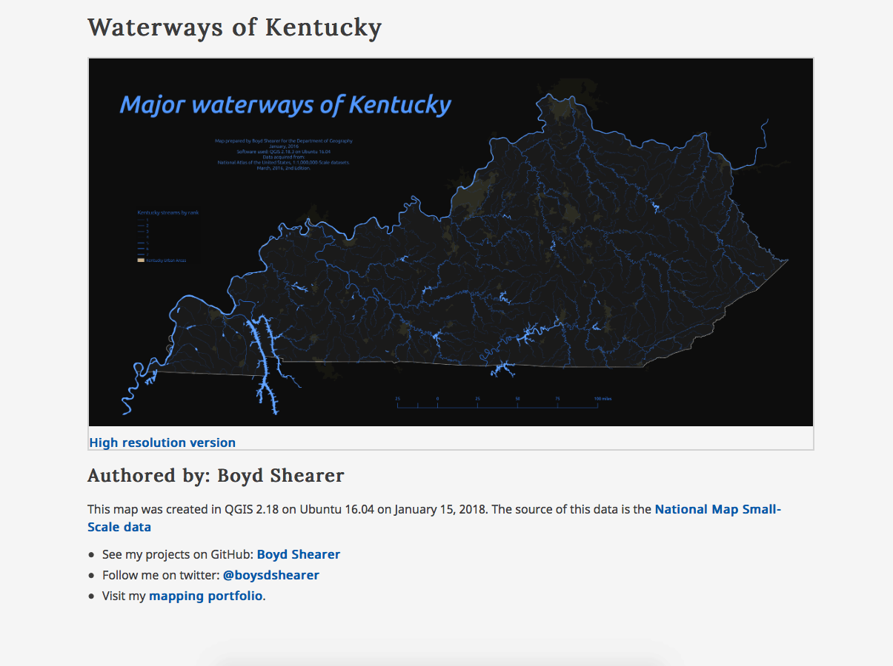
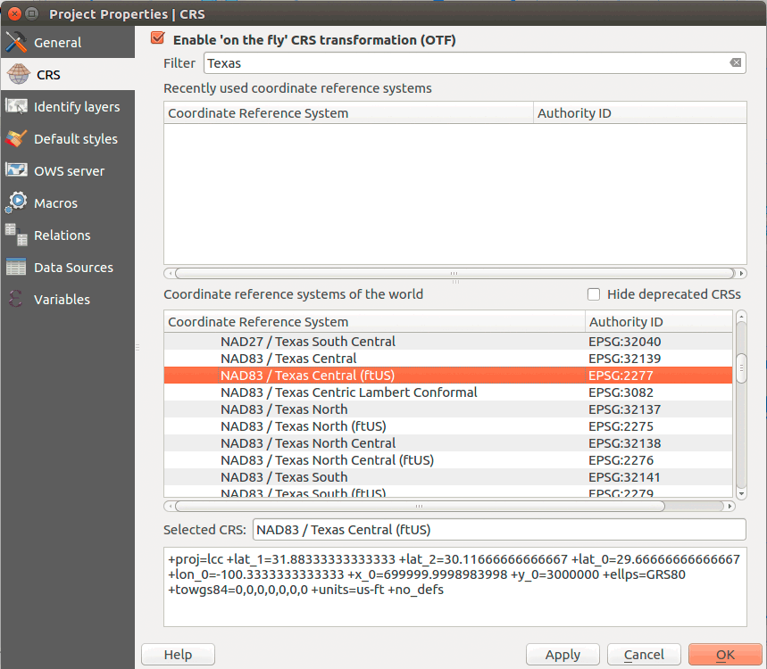

# Module 03 Lab Assignment

This is a continuation of lab 02, learning QGIS. This portion will focus on map making and web publishing.

## Table of Contents

<!-- TOC depthFrom:1 depthTo:6 withLinks:1 updateOnSave:1 orderedList:0 -->

- [Module 03 Lab Assignment](#module-03-lab-assignment)
	- [Table of Contents](#table-of-contents)
	- [Overview](#overview)
	- [Data files](#data-files)
	- [Part III: Work through lesson document (2 pts)](#part-iii-work-through-lesson-document-2-pts)
		- [Submission](#submission)
	- [Part IV: Create a web page map of your home state waterways (4 pts)](#part-iv-create-a-web-page-map-of-your-home-state-waterways-4-pts)
		- [Required specifications of the deliverable](#required-specifications-of-the-deliverable)
		- [Extra Credit (2 pts)](#extra-credit-2-pts)
		- [Submission](#submission)
	- [Example](#example)
	- [Making maps of other states?](#making-maps-of-other-states)

<!-- /TOC -->

## Overview

Your contract with HydroTime has moved to phase two. They are interested in visualizing the stream networks in Kentucky. Your contract specifies that you need to make a web page that shows the streams with an option to look at a high resolution version of the map. They want a web page served from a new repo with a URL like: *username.github.io/bluegrass/waterways*.

The requirements of the map are listed below. You will submit all deliverables to the Canvas assignment page. All the tasks required to fulfill this assignment are documented within Module 03.

## Data files

Use the layers you created in the last lab. The should be available from your PostGIS database or from the GeoJSONs you created. Please don't add duplicate copies of GeoJSONs to work on this module.

## Part III: Work through lesson document (2 pts)

Work through the lesson where you practice making a waterways map and web page for Kentucky. Commit the changes and push the repository when you are finished.

### Submission

Paste URL link within the Canvas to this repo, e.g., *uky-gis/geo409-module-03-<username>*.

## Part IV: Create a web page map of your home state waterways (4 pts)

Apply the skills learned in the lesson to the data you created in the last module.

### Required specifications of the deliverable

1) The final map must fulfill the following requirements:

* The map must display the full extent of Kentucky.
* Lakes must be shown and symbolized appropriately.
* Streams must be symbolized by stream order, where higher order streams have larger line widths.
* Urban areas need to be shown.
* The style of your map layers and layout are up to you, but please observe intuitive color schemes. Consult [using colors on thematic maps](http://axismaps.github.io/thematic-cartography/articles/color_schemes.html) and general guidelines with [ColorBrewer](http://colorbrewer2.org/).
* Map must have a meaningful title, an appropriate legend, and scale bar.
* Map page must include metadata information including the source and the projection information
* An appropriate coordinate reference system must used for the map and you'll need enable **Project Projects > CRS > Enable 'on-the-fly' CRS transformation** or project each layer during a **Save As..**. Kentucky uses EPSG: 3089.

2) The client has requested a web page that shows the map with link to a higher resolution version. This web page map must meet the following requirements:

* Map needs to be in two resolutions: 1) width of 1,200 px and 2) width of 8,000 px
* Follow the lesson to learn how to format a web page.
* Map image format should be a PNG.
* A link must be available to access the higher resolution version.
* The web page must have must have a meaningful title (both in the header element and in the h1 element) and metadata about the author, data source, and brief description of purpose.
* Contact information in footer must be tuned to you, the author.
* The map page must be called "index.html" in a folder called "waterways" in in a new repo called "bluegrass". The map should be accessible at an URL similar: _https://username.github.io/bluegrass/waterways_

### Extra Credit (2 pts)

Use high resolution data from your streams, rivers, and waterbodies. Visit the [The National Map download interface](https://viewer.nationalmap.gov/basic) and get the USGS National Hydrography Dataset (NHD) Best Resolution 20170917 for Kentucky State as a Shapefile format. Load that layer into your project and use instead the stream layer created in module 02. Can you use the metadata to decipher the hydrological features are modeled in this data? What type of symbology changes will you need to make? 

### Submission

Paste URL link within the Canvas for your new GitHub repository (*https://github.com/username/bluegrass). The public URL for your waterways map should be (*https://username.github.io/bluegrass/waterway*) in GitHub Pages. Note the differences between the and the rendered HTML version in GitHub Pages.

## Example

    
Figure 3: Example web page with map

## Making maps of other states?

Change the projection!

Finding an acceptable CRS for a different state will take a little research (because many exist). For mapping larger areas like continents, it is easier to select a CRS because we have an smaller but established set.

Changing coordinate reference systems is pretty easy. In your QGIS **Project Properties > CRS** you can search for the "Florida NAD83" projected coordinate system definition, which is appropriate for these states. For example, if you wanted to find an appropriate CRS for Texas, you can search QGIS for State Plane versions with NAD83 datum and US ft as units:

    
Figure 1: Search for CRS for Texas in QGIS

This selects a State Plane CRS (SPCS) for Central Texas using US feet as units. Each US state will have at least one SPCS and most states have multiple versions that are tuned to a specific region of the state. Pick one that gives a balanced representation for your state. These local CRS should always be used when making small area maps. The goal is minimize map distortion so we can accurately display features. You could also use [UTM zones](https://en.wikipedia.org/wiki/Universal_Transverse_Mercator_coordinate_system) or even create your own projection with [Flex Projector](http://www.flexprojector.com/about.html).

Many CRS are nearly duplications. Notice the SPCS shown below has the projection parameters (though in slightly different order with slightly different values) but a different EPSG code, EPSG: 2277 (above) versus EPSG: 102738 (below).

    
Figure 2: Search for CRS for Texas in QGIS

Search [EPSG.io](https://epsg.io) and [SpatialReference.org](http://spatialreference.org/) for help understanding EPSG codes, which is the predominate way of specifying a CRS. If you need more background about selecting a CRS, please find the reading as PDF in the Canvas module.
